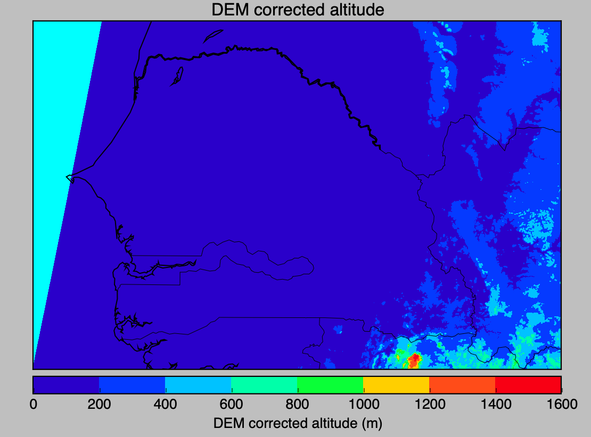

# Sentinel products
### Steps for processing and plotting

- Connect to www.peps.cnes.fr 
- Make a research based on location
- Download the relevant products 
- Apply this python code to extract the data and plot

```python
#########################################
#	Plotting DEM Data From Sentinel		    #
#########################################

import numpy as np
from netCDF4 import Dataset  # http://code.google.com/p/netcdf4-python/
import matplotlib.pyplot as plt
from mpl_toolkits.basemap import Basemap

DEM = 'altitude'
TOZON = 'total_ozone'
TCWV = 'total_columnar_water_vapour'
SEA_PRESSURE = 'sea_level_pressure'

DEM_FILE = 'geo_coordinates.nc'

def plot_parameter(coord_file, elevation):
        nc_c = coord_file 
        nc_coord = Dataset(nc_c, 'r')   

        lats = nc_coord.variables['latitude'][:]  # extract/copy the data
        lons = nc_coord.variables['longitude'][:]
        param_to_plot = nc_coord.variables[elevation][:]

        map = Basemap(llcrnrlon=-18.,llcrnrlat=11.9,urcrnrlon=-10.,urcrnrlat=17.,resolution='i', projection='tmerc', lat_0 = 14.666020, lon_0 = -14.787668)
        #map=Basemap(projection='mill',lat_ts=10,llcrnrlon=lons.min(),urcrnrlon=lons.max(),llcrnrlat=lats.min(),urcrnrlat=lats.max(),resolution='c')
        map.drawcoastlines()
        map.drawstates()
        map.drawcountries()
        map.drawlsmask(land_color='Linen', ocean_color='aqua')

        #lon, lat = np.meshgrid(lons, lats)
        x, y = map(lons, lats)

        elevation_ = map.contourf(x,y,param_to_plot[:])
        cb = map.colorbar(elevation_,"bottom", size="5%", pad="2%")
        plt.title(nc_coord.variables[elevation].long_name)
        cb.set_label("%s (%s)" % (nc_coord.variables[elevation].long_name,nc_coord.variables[elevation].units))
        plt.show()

plot_parameter(DEM_FILE,DEM)
```

### Execute on the terminal the following command
```python
$ python dem.py
```

### Expected result
{:height="10%" width="10%"}


